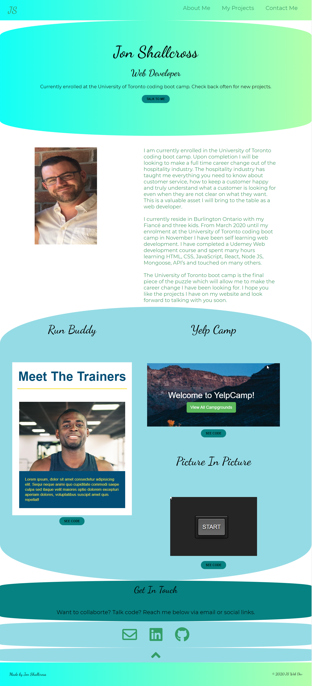

# Portfolio
Web Developer Portfolio

This was the week 2 challenge from the University of Toronto School of Continued Studies Coding Boot Camp. This portfolio shows how far I came from week 2 until the React portfolio I created in week 20. The requirements had us use HTML, CSS, Flexbox and CSS Grids. I received a mark of 98%.

Live Website https://jshallcross.github.io/portfolio/
## My Projects
My projects images link to live deployments
See Code button links to Github repositories

## Languages Used
HTML, CSS, FlexBox, CSS Grids

## Screenshot

## License
[MIT](https://choosealicense.com/licenses/mit/)
